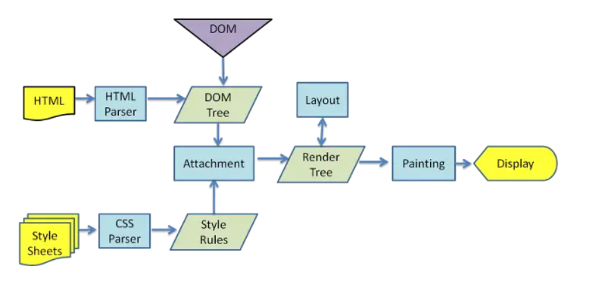

## 1.浏览器渲染过程

1. 解析HTML，生成DOM树，解析CSS，生成CSSOM树
2. 将DOM树和CSSOM树结合，生成渲染树(Render Tree)
3. Layout(回流):根据生成的渲染树，进行回流(Layout)，得到节点的几何信息（位置，大小）
4. Painting(重绘):根据渲染树以及回流得到的几何信息，得到节点的绝对像素
5. Display:将像素发送给GPU,展示在页面上

## 2.什么是回流(重排)和重绘？

1. 回流(Reflow)：当渲染树中的一部分(或全部)因为元素的规模尺寸、位置、隐藏等改变而需要重新构建时，浏览器需要重新计算元素的位置和几何属性，这个过程称为回流。
2. 重绘(Repaint)：当渲染树中的一部分(或全部)因为元素的颜色、背景、边框等改变而需要更新时，浏览器只需要更新这些元素的显示部分，这个过程称为重绘。

## 3.如何减少回流和重绘？
1. 使用cssText,class等修改样式
2. 避免频繁操作dom，批量修改dom
3. 避免使用table布局，使用flex布局
4. 可以先display:none，然后操作dom，最后display:block，这样只会触发一次回流和重绘
5. 动画效果可以使其绝对位移脱离文档流，避免父元素触发回流和重绘
